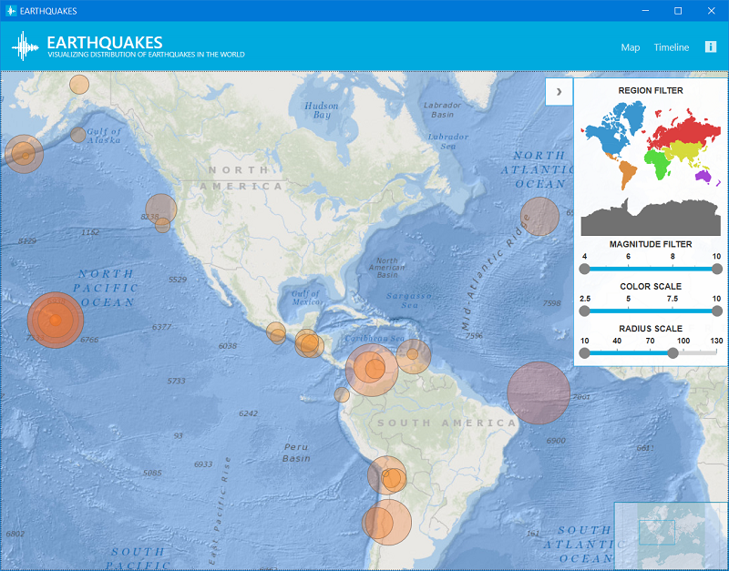
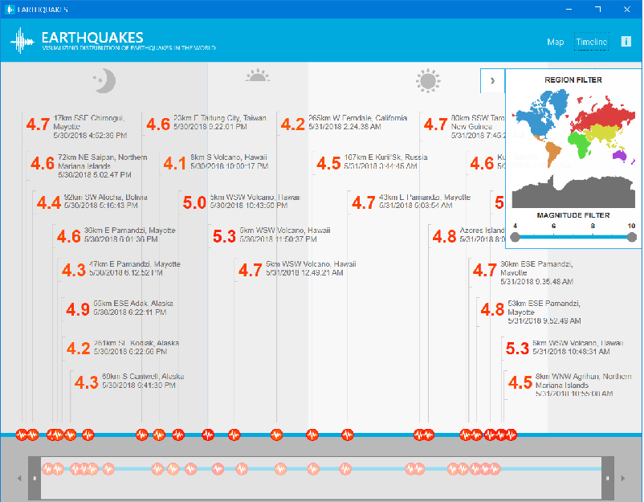

# EarthQuake Application

The EarthQuake application highlights the use of high volume, real time streaming data from the US Geological Survey service, presented in either a geographical or a chronological view. With the map view, the application plots the locations of recent seismic activity on the Geographical Map control with zooming and panning functionalities. Users may also filter the information about earthquakes based on their region, location, and magnitude. With the timeline view, users can select the time range using the slider control. With both these application views, users can get more detailed information about the events like the longitude/latitude, time and other scientific data.

## Map View

## Timeline View
