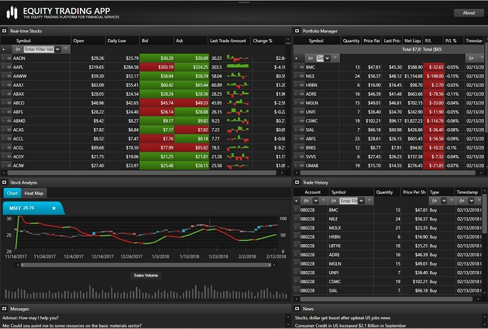

# Equity Trading

The Equity Trading application highlights the use of Infragistics controls applied to a scenario often seen in the Financial Services industry. This application is a basic equity trading platform that covers the typical interactions a trader might perform in the course of their work – from using a heat-map to review industry and sector performance, browsing real-time stock price data with rich data presentation, analyzing historical share price data using highly-interactive charts featuring financial indicators, and finally buying and selling equity while viewing charts with plotted stock prices at real-time. This functionality is delivered within a flexible layout control called the Tile Manager control, which allows the user to resize and arrange the different application modules to suit their workflow and preferences. The user can also maximize tiles they would like to focus on, with the rest of the tiles neatly minimized on one side. Transitions between tile changes are animated providing a rich and interactive user experience.

