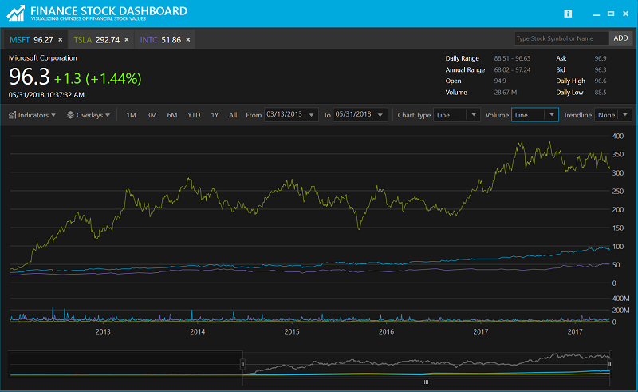

# Finance Stock Dashboard

The Finance Dashboard is an interactive application demonstrating the capabilities of Infragistics Financial Chart control applied to the Financial Services industry. The Stock Chart view of the application is built using the Financial Chart, which has been optimized for high speed financial charting. The Financial Chart supports multiple datasets with millions of data points and real time updates. In addition, this control enables key statistical and technical indicators as well as comparisons to key competitors. Viewing options include 1, 3, 6 months, 1 year, year-to-date, and "Max" with zoom bar. In addition, the comparative analysis charts a company stock price with key competitors. Real-world applications of this sample may include inclusion into a line-of-business application or an external customer-facing application.

