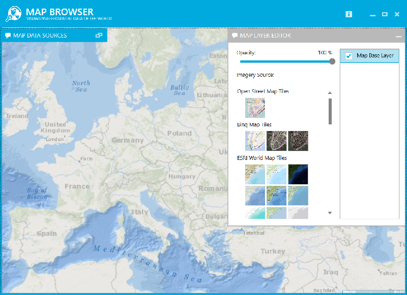
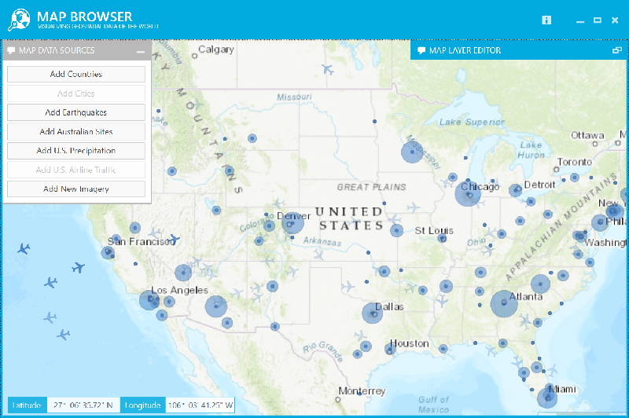
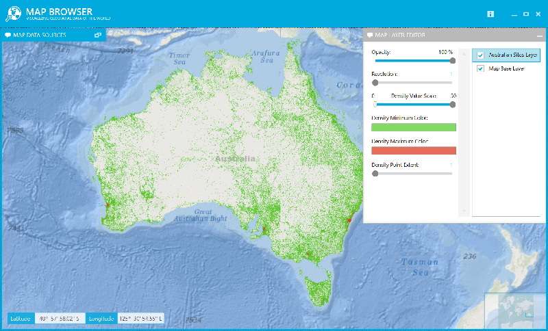

# Geographic Map Browser

The Geographic Map Browser is an interactive application highlighting the capabilities of the Infragistics Geographic Map control which allows creation of composite maps by plotting geospatial data on imagery tiles from Bing Map, OpenStreetMap, CloudMade, ESRI, and MapQuest sources. This application provides data sources of all countries of the world, biggest cities in the world, earthquakes, airline traffic and precipitation over the United States, and hundreds of thousands of geo-locations in Australia. Each data set is visualized using geographic map layer that can be edited for appearance as well as overlaid over other map layers plotted in Geographic Map control. For example, earthquake locations can be plotted over a map layer with locations of biggest cities to provide geographic context for a map visualizing how many densely populated places in the world are affected by earthquakes.

### Map Imagery Tiles
 

### Map Air Traffic
 

### Map Million of Points
 

