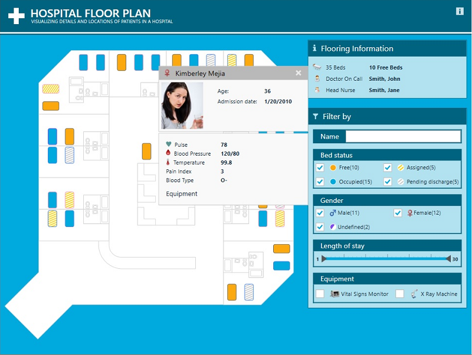

# Hospital Floor Plan

The Hospital Floor Plan sample was designed to highlight how custom shape files and filters could be used in a healthcare setting to build an application that promotes efficiency in monitoring patients and resources.  This application visually depicts one floor of a hospital, providing detailed, relevant information about the patients and staff on XamGeographicMap control by converting hospital shape elements from Cartesian to geographic coordinate system.

