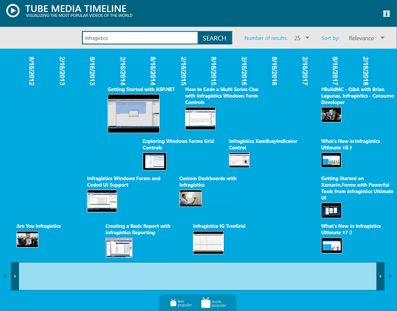

# Media Timeline

The Media Timeline is a consumer targeted application highlighting entertainment/media usage overtime.  This application uses the Infragistics Timeline control to allow users to browse and select video clips.  Taking a data feed from the public YouTube data source, the application visually displays popularity of video clips based on how many times they have been viewed.  The clips are ordered based on when they were published.  Users can filter on relevance, view count, date published, or do a keyword search.

